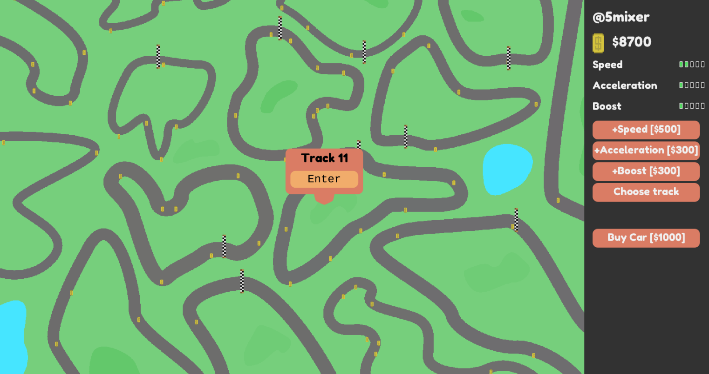

# LD47
Ludum Dare 47 Entry - Theme: 'Stuck in a loop'

Incomplete project based around the idea of mixing multiplayer arcade racing games with the economy element of clickers. Cars would race around tracks collecting coins that could be spent upgrading cars or buying new cars. Placing and driving cars that collected coins faster than other networked players would give you a competitive advantage.

Did not use full 48 hours of ludum dare and did not submit. Multiplayer games aren't very suitable for ludumdare and the game had some design issues. Learnt about network syncing, vector art creation and 'immediate mode GUI' implementation.

Features
 - Networked, so you can see and compete with other players.
 - Car upgrading with immediate mode GUI implementation
 - Uses Kha for a cross-platform client side
 - Uses Node JS as an extremely simple server side

